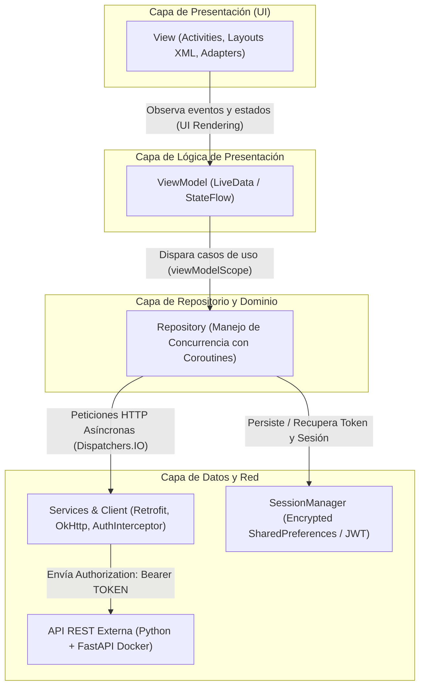

# 🏛️ Documento de Arquitectura de Software: MVVM (Model - View - ViewModel)

**Proyecto:** Aplicación Móvil Nativa de Concurrencia y Consumo de API REST  
**Estudiante:** Victor Manuel Bueno Grullón  
**Matrícula:** 1177316  
**Tecnologías:** Android Kotlin (Frontend) + Python FastAPI (Backend)  
**Institución:** Universidad Tecnológica de Santiago (UTESA)  

---

## 1. Introducción y Justificación de la Arquitectura

Para el desarrollo de la aplicación móvil se implementó el patrón de diseño arquitectónico **MVVM (Model - View - ViewModel)** recomendado oficialmente por Google para Android.

El objetivo fundamental de MVVM es lograr una **separación estricta de responsabilidades (SoC - Separation of Concerns)**, facilitar las pruebas unitarias y garantizar la desacoplación entre la interfaz gráfica (UI) y la lógica de negocio o de acceso a datos.

---

## 2. Descripción Detallada de las Capas

### 2.1. View (Vista)
- **Responsabilidad:** Renderizar la interfaz de usuario, capturar las interacciones del usuario (clics, textos, selecciones de archivos) y observar los estados emitidos por el ViewModel.
- **Componentes en el proyecto:**
  - `LoginActivity`: Formulario de acceso con selector de servidor.
  - `RegisterActivity`: Formulario de registro de nuevas cuentas.
  - `DashboardActivity`: Vista principal con banner de tiempo concurrente, métricas del sistema y accesos directos.
  - `UserListActivity`: Listado con `RecyclerView`, SwipeRefresh y botón flotante (FAB).
  - `UserDetailActivity`: Vista detallada con metadatos del usuario y foto remota.
  - `UserFormActivity`: Formulario unificado de creación/edición con selector y subida multipart de fotos.
  - `ConcurrencyBenchmarkActivity`: Pantalla de laboratorio de rendimiento para la comparación en vivo de tareas secuenciales vs concurrentes.
  - `ProfileActivity`: Vista de edición del perfil propio y cambio de avatar.
  - **Principio clave:** Las vistas no contienen lógica de negocio ni llamadas directas de red.

### 2.2. ViewModel
- **Responsabilidad:** Mantener el estado de la interfaz de usuario, sobrevivir a cambios de configuración (como rotación de pantalla) y orquestar las llamadas a los repositorios mediante `viewModelScope`.
- **Componentes en el proyecto:**
  - `AuthViewModel`: Controla el estado de autenticación (`loginState`, `registerState`).
  - `DashboardViewModel`: Gestiona la carga simultánea del dashboard (`dashboardState`).
  - `UserViewModel`: Administra la lista de usuarios, operaciones CRUD y subida de fotos.
  - `BenchmarkViewModel`: Orquesta la ejecución secuencial y paralela de tareas, emitiendo actualizaciones en vivo de cada hilo y tarea individual.
  - `ProfileViewModel`: Maneja la actualización de datos de perfil y avatares.

### 2.3. Repository (Repositorio)
- **Responsabilidad:** Servir como única fuente de la verdad para los datos, abstrayendo si la información proviene de la red (Retrofit) o del almacenamiento local (SessionManager).
- **Componentes en el proyecto:**
  - `AuthRepository`: Maneja el flujo de login, registro, obtención de perfil y persistencia de JWT.
  - `UserRepository`: Abstrae las 5 operaciones CRUD sobre `/users`.
  - `UploadRepository`: Transforma archivos locales en `MultipartBody.Part` y los envía a `/upload`.
  - `DashboardRepository`: Implementa la concurrencia con `coroutineScope` y `async`/`await` para consultar perfil, métricas, usuarios y notificaciones en paralelo.
  - `BenchmarkRepository`: Implementa los dos algoritmos de prueba (bucle secuencial vs `async.awaitAll()` en paralelo) calculando los tiempos de ejecución.

### 2.4. Services & API Client
- **Responsabilidad:** Configurar el cliente HTTP (OkHttp), inyectar automáticamente el encabezado de autorización `Authorization: Bearer <TOKEN>` mediante `AuthInterceptor`, deserializar las respuestas JSON con `GsonConverterFactory` y manejar timeouts.
- **Componentes:**
  - `ApiService`: Interfaz declarativa de Retrofit con funciones suspendidas (`suspend fun`).
  - `ApiClient`: Objeto Singleton con soporte para cambio dinámico de URL base.
  - `AuthInterceptor`: Interceptor de OkHttp que adjunta el JWT en cada petición saliente.

### 2.5. Models / DTOs (Data Transfer Objects)
- `User`, `UserCreateRequest`, `UserUpdateRequest`
- `LoginRequest`, `AuthResponse`
- `UploadResponse`
- `StatsResponse`, `NotificationItem`, `DashboardData`
- `BenchmarkTask`, `BenchmarkResult`, `TaskState`
- `Resource<T>`: Clase sellada para encapsular los estados `Success`, `Error` y `Loading`.
